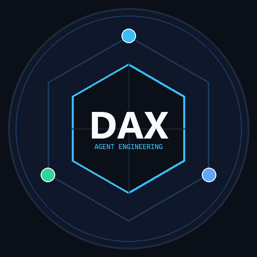

<div align="center">



# DAX
### AI & Agent Engineer

**Building local-first AI agents, developer tools, and safe computer automation.**

*“I build agents that do more than generate text — they plan, act, verify, and improve.”*

<br/>

[]()
[](https://dax-eng.github.io)
[]()
[](https://opensource.org/licenses/MIT)
[](https://www.python.org/)

<br/>

```
  🧠 Intelligence               🛠️ Tools                    🛡️ Verification
  Local Multi-Backend           Sandboxed Execution         Evidence-Backed Results
  Task Planning & Memory        AST Code Manipulation       Human Approval Gating
```

</div>

---

## 🧭 Who We Are

We don't just build chatbots. We build systems where artificial intelligence understands an objective, coordinates real-world tools, executes work, and validates the result before declaring completion.

Our engineering focus is dedicated to:
- **Autonomous AI Agents**: Structured reasoning loops that combine memory, decomposition, and execution.
- **Local AI & Privacy**: Keeping data, prompts, and inference strictly on local hardware.
- **Coding Automation & AST Verification**: Moving beyond raw text generation to syntax-verified diff patching.
- **Computer Interaction**: Safe, sandboxed desktop action engines bound by strict operating system guardrails.
- **Deterministic Tooling**: Wrapping stochastic models with reliable schemas, bounds, and audit trails.

---

## 🎯 Why I Build This

Artificial intelligence becomes truly valuable when it transitions from:
> *“Telling you what to do”* ──► **“Understanding the goal, executing the work, and verifying the result.”**

Modern agent engineering shouldn't depend solely on brittle prompt instructions or opaque cloud runtimes. By focusing on **local execution**, **deterministic tools**, **human-in-the-loop control**, and **empirical verification**, we can build autonomous software that is powerful, transparent, and completely under user control.

---

## 📐 Engineering Philosophy

Our work is guided by five core principles:

1. **Local First** — Whenever possible, reasoning, context, and data stay on the local machine.
2. **Tools, Not Just Prompts** — Models become practically useful when equipped with structured, reliable tools.
3. **Verify, Don't Assume** — Successful execution must always be backed by evidence (AST parsing, tests, dry-runs).
4. **Human Control** — Sensitive, destructive, or state-altering actions require explicit human confirmation.
5. **Build Small, Compose Systems** — Small, decoupled, and thoroughly tested components compose into robust agent architectures.

---

## 🏗️ The DAX Agent Engineering Series

```
                                  +-----------------------------+
                                  |     USER GOAL & CONTEXT     |
                                  +--------------+--------------+
                                                 |
                                                 v
                      +----------------------------------------------------+
                      |     FLAGSHIP AGENT RUNTIME: nexus-agent            |
                      |  • Dynamic Task Planner    • Local Model Router    |
                      |  • Two-Tier Memory Store   • Safety Policy Engine  |
                      +--------------------------+-------------------------+
                                                 |
                                [ Dispatches To Specialized Tools ]
                                                 |
                     +---------------------------+---------------------------+
                     |                                                       |
                     v                                                       v
+------------------------------------------+    +------------------------------------------+
|      CODE TOOLING: micro-coding-agent    |    |   DESKTOP TOOLING: desktop-action-agent  |
| • Safe Workspace Reader                  |    | • Window Discovery & Focus Manager       |
| • Pre-Flight Unified Diff Dry-Runs       |    | • Process Whitelist & Command Filter     |
| • Human-in-the-Loop Approval Gating      |    | • Bounded Input Simulation (Click/Type)  |
| • AST Syntax Integrity Verification      |    | • Cryptographic SHA-256 Audit Trail      |
+------------------------------------------+    +------------------------------------------+
```

---

## 🚀 Repositories & Architecture Breakdown

### 🧠 Flagship: [nexus-agent](https://github.com/dax-eng/nexus-agent)
> **Local-First AI Agent Reference Core**  
> Dynamic model routing (Ollama / vLLM / mock), task decomposition, 2-tier context & episodic memory, and bounded workspace tools.  
> `Status`: Public • `Tests`: 7/7 Passing • `CI`: Passing • [Explore Repository &rarr;](https://github.com/dax-eng/nexus-agent)

### 💻 Specialized Tooling: [micro-coding-agent](https://github.com/dax-eng/micro-coding-agent)
> **Deterministic AI Coding Engine**  
> Workspace indexing, atomic diff patching, pre-flight AST syntax verification, and approval gating.  
> `Status`: Public • `Tests`: 12/12 Passing • `CI`: Passing • [Explore Repository &rarr;](https://github.com/dax-eng/micro-coding-agent)

### 🖥️ Specialized Tooling: [desktop-action-agent](https://github.com/dax-eng/desktop-action-agent)
> **Safe Sandboxed Desktop Automation**  
> Window management, application allowlists, bounded screen inputs, and tamper-evident SHA-256 audit logs.  
> `Status`: Public • `Tests`: 10/10 Passing • `CI`: Passing • [Explore Repository &rarr;](https://github.com/dax-eng/desktop-action-agent)

---

## 🔬 What I'm Exploring

- **Local Agent Runtimes**: Low-latency orchestration against local quantization runners.
- **Computer-Use Systems**: Bounded OS interaction primitives with accessibility tree integration.
- **Verification-Driven Coding**: Automated test generation, AST diagnostics, and rollback engines.
- **Agent Memory Topologies**: Hybrid episodic buffers and vector retrieval for long-horizon tasks.
- **Safe Autonomous Execution**: Cryptographic audit trails and fine-grained capability isolation.

---

## 🛠️ Tech Stack

- **Core & Runtime**: Python 3.9+, Bash, Subprocess Management
- **AI & Reasoning**: Local Inference (Ollama / vLLM / LM Studio), Tool Calling, JSON Schema Validation
- **Code & Parsing**: Abstract Syntax Trees (`ast`), Unified Diff Engines (`difflib`)
- **Safety & Verification**: Sandboxing, Permission Policies, SHA-256 Cryptographic Audit Logging
- **Quality & CI**: Pytest, GitHub Actions Multi-Version Matrix, Ruff, Mypy

---

## 📦 Open Source

These repositories are independent reference implementations designed to explore and document practical agent engineering patterns. Every project includes real automated test suites, clean documentation, and MIT licensing.

---

## 📬 Connect

- **LinkedIn**: [Mohamed Musa Ahmed](https://www.linkedin.com/in/mohamed-musa-marouf-ahmed-7030561b8/)
- **GitHub**: [@dax-eng](https://github.com/dax-eng)
- **Security & Inquiries**: `dax-eng@users.noreply.github.com`

